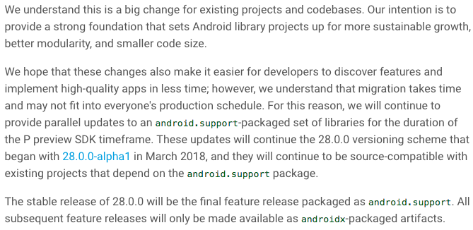
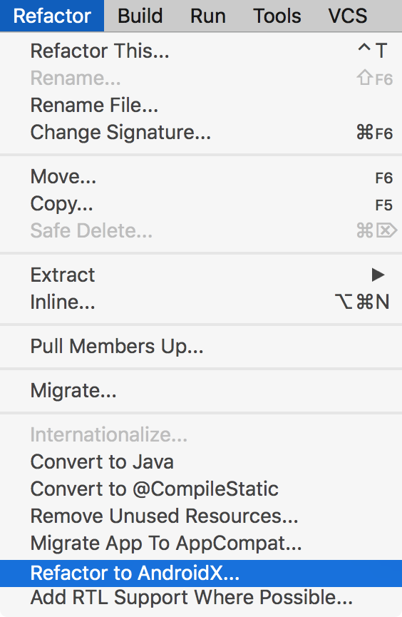

# Android 全新支持库 androidx

> * **作者**：March
> * **链接**：[安卓项目或模块](https://github.com/maoqiqi/DevelopmentArms)
> * **邮箱**：fengqi.mao.march@gmail.com
> * **头条**：https://toutiao.io/u/425956/subjects
> * **简书**：https://www.jianshu.com/u/02f2491c607d
> * **掘金**：https://juejin.im/user/5b484473e51d45199940e2ae
> * **CSDN**：http://blog.csdn.net/u011810138
> * **SegmentFault**：https://segmentfault.com/u/maoqiqi
> * **StackOverFlow**：https://stackoverflow.com/users/8223522
>
> 著作权归作者所有。商业转载请联系作者获得授权，非商业转载请注明出处。


Google 2018 IO大会推出了Android新的扩展库AndroidX，用于替换原来的Android扩展库，将原来的`android.*`替换成`androidx.*`。


## 目录

* [Overview](#Overview)
* [Influence](#Influence)
* [Using](#Using)
  * [新建](#新建)
  * [迁移到AndroidX](#迁移到AndroidX)
* [Mappings](#Mappings)
* [Resources](#Resources)
* [License](#License)


## Overview

AndroidX是对原来Android支持库的一个重大改进。与支持库一样，AndroidX与Android操作系统是分开发布的，并提供了跨Android版本的向后兼容性。
AndroidX通过提供特性奇偶性和新的库，完全取代了支持库。此外，AndroidX还包括以下功能:

* AndroidX中的所有包都位于一个以字符串`androidx`开头的一致名称空间中。支持库包已经映射到相应的`androidx.*`包中。
  有关所有旧类和构建构件到新类的完整映射，请参见[包重构](https://developer.android.google.cn/jetpack/androidx/migrate)页面。
* 与支持库不同，AndroidX包是单独维护和更新的。`androidx`包从1.0.0版本开始使用严格的语义版本控制。您可以在您的项目中独立更新AndroidX库。
* 所有新的支持库开发都将在AndroidX库中进行。这包括维护原始支持库构件和引入新的Jetpack组件。


## Influence



官方博客中说道，为了给开发者一定迁移的时间，所以28.0.0的稳定版本还是采用`android.support`。但是所有后续的功能版本都将采用`androidx`。

其实对于我们影响也不是很大，我们可以选择不使用，毕竟不是强制的。但长远看来还是有好处的。

对于有写一些开源项目的人，可能会有一些影响。比如你有一个关于RecyclerView的拓展库，那么你就需要去让他支持AndroidX，否则你懂的。


## Using

### 新建

如果您想在一个新项目中使用AndroidX，您需要将compile SDK设置为Android 9.0 (API级别28)或更高，
并在您的`gradle.properties`文件中将以下两个Android Gradle 配置设置为true。

* `android.useAndroidX`：当设置为true时，Android插件使用适当的AndroidX库，而不是支持库。如果没有指定该标志，则该标志默认为false。
* `android.enableJetifier`：当设置为true时，Android插件会自动迁移现有的第三方库，通过重写它们的二进制文件来使用AndroidX。如果没有指定该标志，则该标志默认为false。

### 迁移到AndroidX

AndroidX将原始的支持库API包映射到`androidx`名称空间。只更改了包和Maven工件名称;类、方法和字段名称没有更改。

> 注意:如果您正在使用Android KTX模块，请确保更新依赖项以避免迁移问题。每个模块的最新版本请参见[Android KTX](https://developer.android.google.cn/kotlin/ktx)。

使用Android Studio 3.2或更高版本，您可以通过从菜单栏中选择`Refactor > Migrate to AndroidX`来快速迁移现有项目以使用AndroidX。



> 在执行该操作时会提醒我们是否将当前项目打包备份。如果你提前已经做好了备份，可以忽略；如果没有备份，请先备份。

如果您有任何Maven依赖项尚未迁移到AndroidX名称空间，当您在`gradle.properties`文件中将以下两个标志设置为true时，Android Studio build系统也会为您迁移这些依赖项：

```
android.useAndroidX=true
android.enableJetifier=true
```

要迁移不使用任何依赖于需要转换的第三方库的现有项目，您可以设置：


```
android.useAndroidX=true
android.enableJetifier=false
```

由于`Migrate to AndroidX`执行之后，部分控件的包名/路径名转换的有问题，所以还需要我们手动调整（包括修改`xml`布局文件和`.java/.kt`文件）。


## Mappings

* [Artifact mappings](https://developer.android.google.cn/jetpack/androidx/migrate#artifact_mappings)
* [Class mappings](https://developer.android.google.cn/jetpack/androidx/migrate#class_mappings)


## Resources

* [AndroidX Overview](https://developer.android.google.cn/jetpack/androidx)
* [Migrating to AndroidX](https://developer.android.google.cn/jetpack/androidx/migrate)
* [AndroidX Blog](https://android-developers.googleblog.com/2018/05/hello-world-androidx.html)
* [AndroidX Release Note Archive](https://developer.android.com/jetpack/androidx/releases/archive/androidx)


## License

```
   Licensed under the Apache License, Version 2.0 (the "License");
   you may not use this file except in compliance with the License.
   You may obtain a copy of the License at

       http://www.apache.org/licenses/LICENSE-2.0

   Unless required by applicable law or agreed to in writing, software
   distributed under the License is distributed on an "AS IS" BASIS,
   WITHOUT WARRANTIES OR CONDITIONS OF ANY KIND, either express or implied.
   See the License for the specific language governing permissions and
   limitations under the License.
```